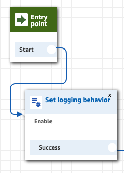
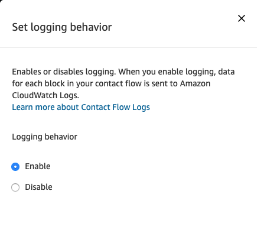
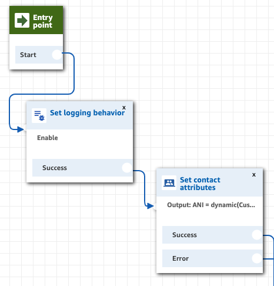
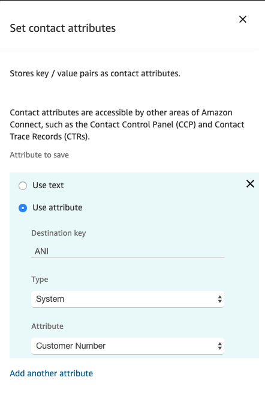
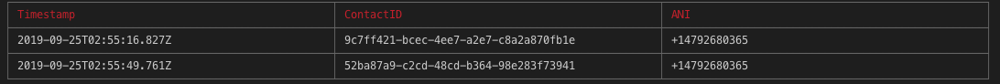
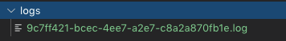
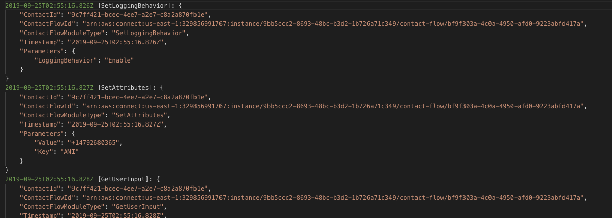

# Amazon connect - log analysis locally

Use Amazon Web Services (AWS) cloudwatch API and amazon connect.

## Introduction
This is a simple nodejs app can be used for troubleshooting your contact flow logs from your local terminal instead of checking the logs in cloudwatch.
This app is used to get the 'contactID' for the test calls you made to a contact flow and pull the logs from cloudwatch for a specific contact ID into a local log file and then you can perform log analysis on that local log file.

## Architecture
   1. This app accepts 2 commands: `get-id` and `get-log`.
   2. Command `get-id` is used to get the contactId's of the test calls you made and accepts three command line parameters: `--name`, `--ani` and `--date`.
   3. Command `get-log` is used to get the contact flow logs and accepts two command line parameters: `--name` and `--id`.
   4. `--name` is for the amazon connect instance name.
   5. `--ani` is for the customer contact number.
   6. `--date` is for the date.
   7. `--id` is for the unique contact id generated for each call.
   8. Nodejs app recognizes the command and parses the arguments that came with it using the library 'yargs' and performs actions based on the command provided.
   9. If command 'get-id ' then cloudwatch API is invoked to get the contactID's, timestamp and display the output in the terminal as a table using the library 'table-cli'.
   10. If command 'get-log' then cloudwatch API is invoked to get the logs and store the log file locally in the root directory './logs/<contactId>.log' using library 'winston'.

## Prerequisites
* [NodeJS 10.x](https://nodejs.org/en/download/)

## Repository content

Main files:

```bash
.
├── README.MD                             <-- Instructions file.
├── package.json                          <-- NodeJS dependencies and scripts for SAM project.
├── Config                                <-- Config file created by code.amazon.com.
├── Images                                <-- Folder containing images for this readme.                                 
│   └── logfile.png                       <-- Log file image.
│   └── loggingBehavior.png               <-- Setting logging behavior image.
│   └── logs.png                          <-- logs in the log file image.                                 
│   └── setANI.png                        <-- Set ANI in set contact attribute image.
│   └── Setcontactattributes.png          <-- Set contact attribute block image.                                 
│   └── setLoggingBehavior.png            <-- Set logging behavior block image.
│   └── tableoutput.png                   <-- cli table output image.                                        
├── src                                   <-- Folder containing all lambda functions for this project.
│   └── index.js                          <-- Main module, start of execution.                                           
│   └── Cloudwatch.js                     <-- Module that exposes 2 methods to get the contactID and get the logs.
│   └── middleware                        <-- Folder that contains middleware.
│     └── logger                          <-- Folder that contains the logger middleware.
│        └── winston.js                       <-- Winston logger javascript.
 

```
## Setup process

* Step 1: Add `Set logging behavior` and `SetAttributes` blocks to your amazon connect contact flow.
   * After the `Entry point` block, add `Set logging behavior` block and enable the logging behavior. 

   

   


   * After `Set logging behavior` block, add `Set contact attributes`block and add an attribute of Deastination key = ANI, Type = System and Attribute = Customer Number.

   

   

**PLEASE NOTE:** Step 1 is very important and without this the program will not work!!!

* Step 2: Clone the repo
   * From the terminal, clone the repo from code.amazon.com
      ```bash
         git clone ssh://git.amazon.com/pkg/Amazon-connect-log-analysis
      ```
* Step 3: Change the directory to the newly created 'Amazon-connect-log-analysis'
      ```bash
         cd Amazon-connect-log-analysis
      ```
* Step 4: Install npm dependencies
   * From the terminal at root, run the below command
      ```bash
         npm i
      ```

* Step 5: Get the contactId's and select the one you want to get the logs for:
   * From the terminal at root, run the below command:
      ```bash
         node ./src/index.js get-id --name='<connect-instance-name>' --ani='<customer number>' --date='<date>'
      ```
      `--date ==> should be in this format: '2019/09/25'`

      `--ani ==> should be in this format: '+14792680365'`

   ***Eg: node ./src/index.js get-id --name='someConnectInstanceName' --ani='+14792680365' --date='2019/09/25'***

   * This command will display the lists of retrieved `timestamp`, `contactID` and the `ANI` in a table format in your terminal.
   
   
 
* Step 6: Get the logs for a specific contactId
   *  From the root directory in terminal run the below command:
      ```bash
         node ./src/index.js get-log --name='<connect-instance-name>' --id='<contactID selected from the previous run of get-id command>'
      ```
   ***Eg: node ./src/index.js get-log --name='someConnectInstanceName' --id='9c7ff421-bcec-4ee7-a2e7-c8a2a870fb1e'***

   *  You will be able to find the log file in your root, under /logs/`<contactId>`.log

   

   